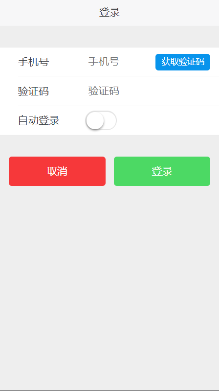
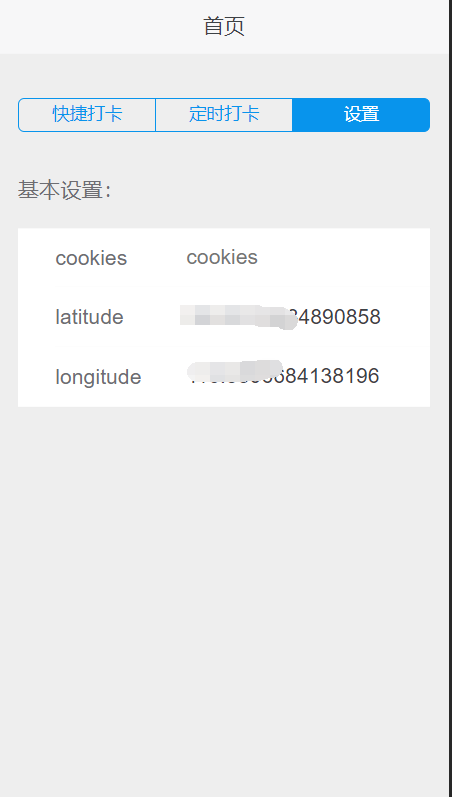

# pouchAtAnyTime

薪人薪事打卡系统破解，随时随地无限制打卡。无心之作，请勿滥用，欢迎技术交流。

欢迎star, 有疑问可以提issue或者email(tracywyj@gmail.com)

支持多端（移动端效果最佳）。

## 功能说明

### 登录

薪人薪事系统注册过的手机号，可直接登录。



### 设置经纬度

- 获取你打卡的位置,去[百度地图坐标查询-拾取坐标系统](http://api.map.baidu.com/lbsapi/getpoint/index.html) 获取POI点坐标。

- 将你的经纬度复制到这里即可。



### 打卡

登录成功，设置好经纬度后，在这可以直接快捷打卡。


### 定时打卡

- todo

### 技术栈

- UI ---- 淘宝的[sui](http://m.sui.taobao.org/components/)

- nodejs(http,request等模块)

- express

- 最后部署在BAE平台上

### 本地

需要nodejs环境

- git clone git@github.com:maixiaojie/pouchAtAnyTime.git

- cd pouchAtAnyTime

- npm install

- npm start

- 浏览器打开 http://localhost:18080

### other

该漏洞已经转告薪人薪事工程师了，什么时候修复还不清楚。


### 更新记录

*20180206*
- 上次告诉薪人薪事之后，他们一周后对代码进行了一次更新。
但是并没有从根源解决这个问题，很快我又解决了这个问题。

```
var l = "longitude=" + sendData.longitude + "&latitude=" + sendData.latitude + "&accuracy=" + sendData.accuracy;
sendData.signature = CryptoJS.enc.Base64.stringify(CryptoJS.HmacSHA1(l, "xrxs&qjyd"));
```

- 添加了退出登录的功能


